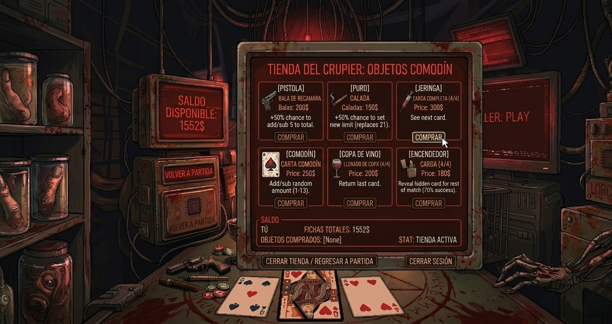

# Diseño del Juego

## Mockups

### Menú


### Juego



### Resultado


## Especificaciones de tecnología
FrameWork elegido: Vue
Elegimos este FrameWork descartando React y Angular ya que existe una leve experiencia en el uso de este, encontrando a este framework mas sencillo y simple para implementar en nuestro proyecto, el React suele ser mas tedioso y mas formal aunque puede lograr el mismo resultado esperado, se inclino por Vue más por un tema de comodidad.
# Gestor de paquetes: Pnpm
### Estructura de carpetas:
El proyecto tendra varias carpetas que tendran respectivos archivos con sus propias funcionalidades pero que se conectaran entre si para el funcionamiento del juego.
```
Carpeta 1: Public/
Archivos: Index.html
Carpeta 2: Src/
Subcarpeta 1: Assets/ (Recursos visuales (imagen de fondo, cartas, sonidos))
Sub-SubCarpeta1: 1- Cards/
             2- Images/
             3- Audio/
Subcarpeta 2: components/    (Componentes reutilizables)
             Archivos: Card.vue
                     GameTable.vue
                     ScreenDisplay.vue
                     PlayerUI.vue
Subcarpeta 3: views/         (Vistas principales)
      Archivos: GameView.vue
                MenuView.vue
SubCarpeta 4: store/           (Estado global del juego)
            Archivos: gameStore.js
SubCarpeta 5: styles/              (Estilos globales)
            Archivos: main.css
Carpeta 3: .github/
Subcarpeta 6: workflows/
            Archivos: main.yml
Carpeta 4: Tests/
Carpeta 5: Mockups/
    Archivos: Durante el juego.png
              Ganar juego.png
              Perder juego.png
              Menu Inicial.png
              Tienda.png
App.vue
Main.js
Archivos sueltos
package.json
pnpm-lock.yaml
Vite.config.js
.gitignore
Dockerfile
.dockerignore
```
### Dependencias
Base del proyecto
Vue.js : Framework principal 
Vite : Entorno de desarrollo y compilación 
Dependencias funcionales
Pinia: Manejo del estado global del juego
 (cartas, turnos, dinero, estado del dealer) 
Vue Router: Navegación entre vistas
 (menú principal, juego, resultados) 
Dependencias visuales y de experiencia
GSAP: Animaciones
 (movimiento de cartas, efectos visuales) 
Howler.js: Sonido
 (efectos de ambiente, interacción)
(Existen dependencias mas potentes que pudieron reemplazar a las actuales como “WebPack” y “Vuex” pero el uso de su desarrollo nos resulta más compleja y dependencias como Vite destacan por su rapidez).
### Entorno de Desarrollo
Visual Studio Code

## Descripción del juego
### Nombre provisional: Contrato 21: El pacto de sangre
“Contrato 21: El pacto de sangre”, es un juego de cartas basado en el clásico 21 blackjack, con una estética tenebrosa/industrial, donde te enfrentarás al “Crupier”, una calavera robótica que busca eliminarte, Apuesta fichas para multiplicar tu dinero entre partida para comprar los objetos que te proporciona la mesa para sacar ventaja.

## Mecánica:
```
Mecánica principal del blackjack 21, se proporciona una carta oculta al jugador 1 y al crupier, y una carta boca arriba que pueden ver ambos, el objetivo es pedir o quedarse considerando que el que más cerca queda de 21 (sumando todas las cartas) gana.
Inclusión de “Objetos”, que pueden cambiar el rumbo del juego, otorgar ventajas o desventajas a la partida.
Pistola: Parte cada partida con 1 bala en recamara, si la usas, tiene 50% de chances de sumar o restar 5 al total del crupier o a ti mismo, tienes un 15% de chances de que te den una bala cada turno, puedes comprar más balas en la tienda usando fichas/dinero.
Puro: Parte cada partida sin “caladas”, tienes un 15% de chances de que te den una “calada” cada turno. Obtienes un 50% de chance de elegir un nuevo limite que reemplaza 21, puedes comprar más “caladas” en la tienda usando fichas/dinero.
Jeringa: Partes con la jeringa vacía, tienes un 20% de chances de obtener ¼ de carga cada turno, puedes comprar más cargas en la tienda usando fichas/dinero. Obtienes la capacidad de ver la siguiente carta que saldrá de la baraja (para ti o el crupier)
Comodín: Partes con 0 cada partida, sin embargo, por cada turno tienes un 20% de chance de obtenerlo, también puedes comprarlo en la tienda por fichas/dinero, eliges si el comodín te suma o resta una cantidad aleatoria entre 1 y 13.
Copa de Vino: La copa parte vacía cada partida, cada turno hay un 20% de chances de que se llene ¼ de esta, también puedes llenar ¼ de la copa (acumulable) con fichas/dinero en la tienda, devuelve la última carta que pediste.
Encendedor: Parte apagado cada partida, cada turno hay un 20% de chances de que den ¼ de carga, también puedes comprar ¼ de carga con fichas/dinero en la tienda, tienes un 70% de chance de ver la carta oculta del crupier por el resto de la partida.
Mecánica de Dinero/Apuestas: El jugador y el crupier parten con 500 fichas/dinero cada turno, deben apostar un mínimo de 50 fichas por turno, pueden subir o mantener la apuesta, si uno sube la apuesta y el otro decide no apostar esa cantidad, se bloquea el uso de todos los objetos por ese turno, el dinero puede ser usado en la tienda entre turnos.
```
### Tienda: 
Puedes comprar cargas de los objetos usando el dinero ganado por medio de las apuestas.

## Flujo de juego:
```
La partida comienza con dos cartas tanto para el crupier como para el jugador, la primera permanece oculta para el otro jugador, por lo que solo estará visible una de las cartas. 
Puede comenzar su turno el crupier o el jugador de forma aleatoria, comienza la fase de apuestas, quien tiene el turno debe hacer la apuesta mínima, subirla o negar la apuesta, si niega la apuesta pierde la posibilidad de utilizar objetos durante ese turno, antes o después de hacer/negar la apuesta puede comprar en la tienda cargas de objetos, luego de hacer/negar la apuesta comienza la partida con 3 opciones.
1.- Pedir: Pide una carta, puede salir del 1 al 13, esta se suma al total de tus cartas
2.-Quedarse: Pasa turno sin pedir una carta, quedándote con las cartas que están en la mesa.
3.-Usar Objeto: Puedes usar un objeto de los disponibles para obtener ventajas. (debe usarse antes de pedir o quedarse) 
Luego de pedir o quedarse, pasa turno al siguiente jugador (jugador o crupier), que puede hacer lo mismo, cada turno se debe hacer/subir/negar las apuestas, si negaste previamente una apuesta, en tu siguiente turno decides si negar (manteniendo el bloqueo de los objetos) o realizar la apuesta.  La partida acaba una vez ambos jugadores deciden quedarse, se cuentan los totales de ambos y el que este más cerca de 21 gana y suma uno al contador de victorias, además se lleva el dinero de las apuestas.
```
### Ejemplo de victoria:
```
Jugador:19, Crupier:22, victoria crupier
Jugador:20, Crupier:22, victoria jugador por estar debajo de 21.
En casos de empate, el que esté por debajo de 21 siempre tendrá la ventaja, si ambos tienen 21, se declara empate y la apuesta se anula, el que gana se le suma uno al contador de victorias. 
Terminada una partida, comienza una nueva repitiendo el mismo ciclo
Gana el juego total quien logra sacar una ventaja de 2 partidas, ejemplo jugador 2-0 crupier, o jugador 4-2 crupier. 
```
